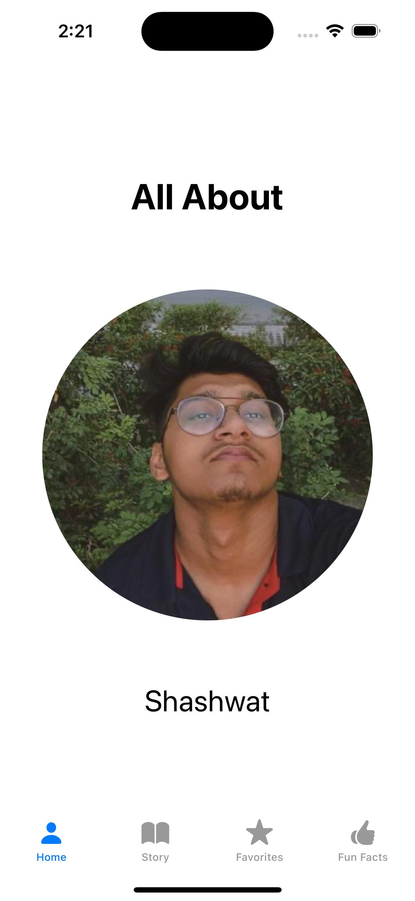
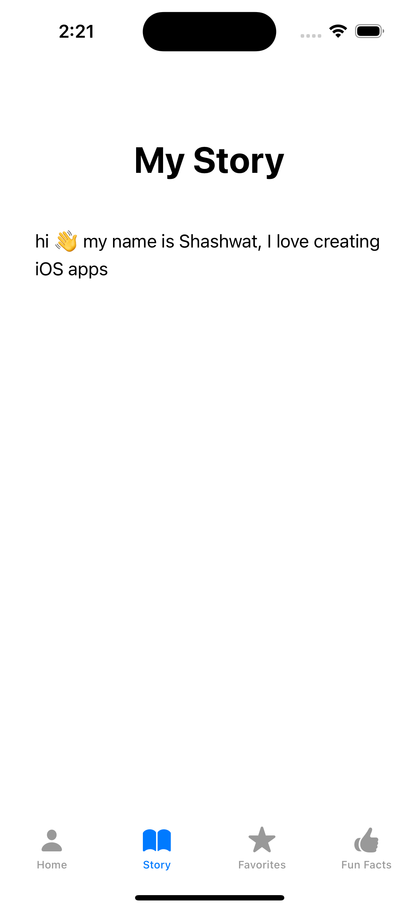
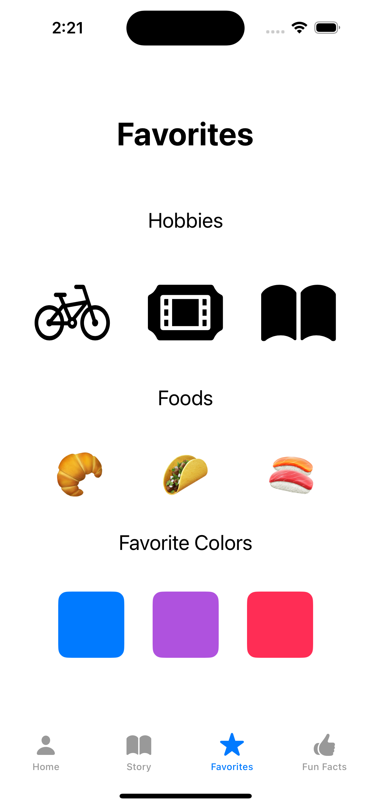
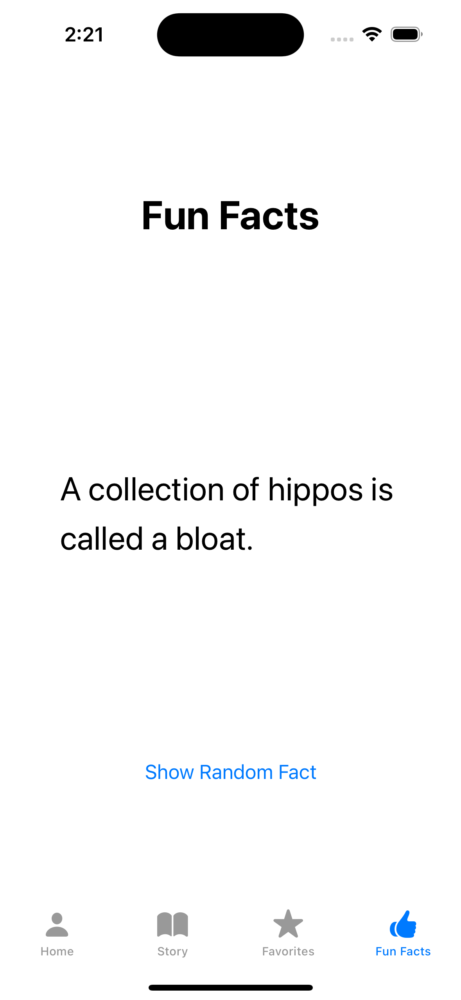

# Sample Apps by Apple

# Great Resource for Developing Basic iOS Apps in SwiftUI

Hi everyone,

I got a great resource from Apple for developing some of the basic iOS apps. Below is the list of the apps made by Apple in SwiftUI:

## [Sample Apps Tutorials](https://developer.apple.com/tutorials/sample-apps)

### Exploring SwiftUI Sample Apps
Explore these SwiftUI samples using Swift Playgrounds on iPad or in Xcode to learn about defining user interfaces, responding to user interactions, and managing data flow.

### Navigating Apps

1. **[About Me](https://developer.apple.com/tutorials/sample-apps/aboutme)** - Welcome to the About Me app. In this walkthrough, you’ll learn the basics of using SwiftUI to display information across multiple tab views.
Run the preview and tap to select the Home, Story, Favorites, and Fun Facts tabs at the bottom of the screen.
You can change all of the data, or content, in the app to be about any topic of your choice. While you walk through this sample, try swapping out the information and edit colors and modifiers to suit your style.
 - **Key Takeaways**:
     - Creating and customizing views
     - Managing basic user input
     - Personalizing user profiles
   - **Screenshots**:

    
    
    
    

     
     

     

